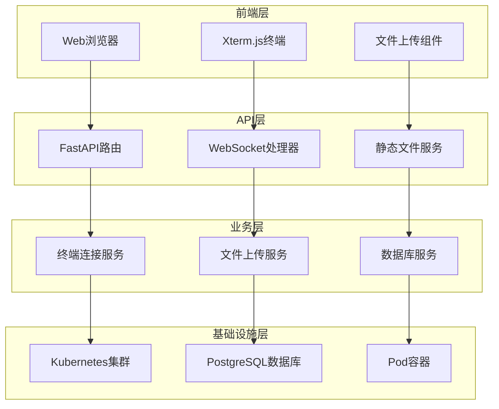

# 🚀 K8S Web Terminal

<div align="center">

[](https://fastapi.tiangolo.com)
[](https://python.org)
[](https://kubernetes.io)
[](https://opensource.org/licenses/MIT)

</div>

一个功能强大的 Kubernetes Pod Web 终端管理工具，提供安全、高效的浏览器内终端访问体验。

## ✨ 核心特性

### 🖥️ 终端功能

- **实时终端访问** - 通过 WebSocket 与 Kubernetes Pod 建立安全连接
- **现代化界面** - 基于 Xterm.js 的功能完整的交互式终端
- **响应式设计** - 终端大小自动适应浏览器窗口
- **心跳检测** - 智能连接状态监控和自动重连机制
- **会话管理** - 支持多 Pod 并发连接和会话保持

### 📁 文件管理

- **拖拽上传** - 支持文件拖拽到终端区域进行上传
- **批量传输** - 自动处理文件压缩和解压缩
- **进度显示** - 实时显示文件上传进度和状态
- **安全验证** - 文件名安全检查和路径验证

### 📊 监控日志

- **操作记录** - 完整的用户操作日志记录
- **连接统计** - 实时连接状态和使用统计
- **健康检查** - 全面的服务健康状态监控
- **数据持久化** - PostgreSQL 数据库存储历史记录

## 🛠️ 技术架构

### 后端技术栈

| 组件                  | 版本    | 说明                 |
| --------------------- | ------- | -------------------- |
| **Python**            | 3.8+    | 核心开发语言         |
| **FastAPI**           | 0.104.1 | 高性能异步 Web 框架  |
| **Uvicorn**           | 0.23.2  | ASGI 服务器          |
| **Kubernetes Client** | 17.17.0 | K8s API 交互客户端   |
| **WebSockets**        | 14.1    | 实时双向通信         |
| **AsyncPG**           | 0.27.0+ | 异步 PostgreSQL 驱动 |

### 前端技术栈

| 组件                | 说明                  |
| ------------------- | --------------------- |
| **HTML5/CSS3**      | 现代化页面结构和样式  |
| **JavaScript ES6+** | 异步编程和事件处理    |
| **Xterm.js**        | 专业级 Web 终端模拟器 |
| **Xterm-addon-fit** | 终端大小自适应插件    |

### 数据存储

| 组件           | 说明                   |
| -------------- | ---------------------- |
| **PostgreSQL** | 用户操作日志和统计数据 |
| **连接池**     | 异步数据库连接管理     |

## 🏗️ 系统架构



## 📁 项目结构

```
k8s-web-terminal/
├── app/                          # 应用核心模块
│   ├── api/                      # API 路由层
│   │   ├── __init__.py
│   │   └── terminal.py           # 终端 API 端点
│   ├── handlers/                 # 处理器层
│   │   ├── __init__.py
│   │   └── websocket_handler.py  # WebSocket 连接处理
│   ├── services/                 # 服务层
│   │   ├── __init__.py
│   │   ├── database.py           # 数据库服务
│   │   ├── k8s_service.py        # Kubernetes 服务
│   │   └── upload_service.py     # 文件上传服务
│   ├── utils/                    # 工具层
│   │   ├── __init__.py
│   │   ├── exceptions.py         # 自定义异常
│   │   └── logger.py             # 日志管理
│   ├── __init__.py
│   ├── config.py                 # 配置管理
│   └── models.py                 # 数据模型
├── templates/                    # 前端模板
│   ├── static/                   # 静态资源
│   │   ├── xterm-addon-fit.js
│   │   ├── xterm.css
│   │   └── xterm.js
│   └── terminal.html             # 终端页面
├── config/                       # 配置文件
│   └── config                    # Kubernetes 配置
├── logs/                         # 日志目录
├── main.py                       # 应用入口
├── requirements.txt              # 依赖列表
└── README.md                     # 项目文档
```

## 🚀 快速开始

### 环境要求

- **Python**: 3.8 或更高版本
- **Kubernetes**: v1.17 或更高版本
- **PostgreSQL**: 12+ (可选，用于日志功能)
- **浏览器**: 支持 WebSocket 的现代浏览器

### 安装步骤

#### 1. 获取代码

```bash
# 克隆仓库
git clone <repository_url>
cd k8s-web-terminal

# 或者下载源码包并解压
```

#### 2. 环境准备

```bash
# 创建虚拟环境
python -m venv venv

# 激活虚拟环境
# Windows
venv\Scripts\activate
# macOS/Linux
source venv/bin/activate

# 升级 pip
pip install --upgrade pip
```

#### 3. 安装依赖

```bash
# 安装生产环境依赖
pip install -r requirements.txt

# 如果是开发环境，可以安装开发工具
pip install -r requirements-dev.txt
```

#### 4. 配置 Kubernetes

```bash
# 创建配置目录
mkdir -p config

# 复制 Kubernetes 配置文件
cp ~/.kube/config config/config

# 确保配置文件权限正确
chmod 600 config/config
```

#### 5. 环境变量配置

创建 `.env` 文件或设置环境变量：

```bash
# 数据库配置（可选）
export POSTGRES_HOST=localhost
export POSTGRES_PORT=5432
export POSTGRES_USER=postgres
export POSTGRES_PASSWORD=your_password
export POSTGRES_DB=k8s_terminal

# 服务器配置
export SERVER_HOST=0.0.0.0
export SERVER_PORT=8006

# 日志配置
export LOG_LEVEL=INFO
export LOG_DIR=logs

# Kubernetes 配置
export K8S_VERIFY_SSL=false
```

#### 6. 数据库初始化（可选）

如果使用日志功能，需要准备 PostgreSQL 数据库：

```sql
-- 创建数据库和用户
CREATE DATABASE k8s_terminal;
CREATE USER k8s_user WITH PASSWORD 'your_password';
GRANT ALL PRIVILEGES ON DATABASE k8s_terminal TO k8s_user;
```

#### 7. 启动应用

```bash
# 开发模式启动
python main.py

# 或使用 uvicorn 直接启动
uvicorn main:app --host 0.0.0.0 --port 8006 --reload

# 生产模式启动
uvicorn main:app --host 0.0.0.0 --port 8006 --workers 4
```

### 生产环境部署

```bash
# 生产模式启动（多进程）
uvicorn main:app --host 0.0.0.0 --port 8006 --workers 4

# 使用进程管理器（推荐）
# 安装 supervisor 或 systemd 来管理进程
```

**注意**: 当前项目未提供 Docker 或 Kubernetes 部署配置文件，如需容器化部署请自行编写相应的配置文件。

## 📖 使用指南

### 基本使用

#### 1. 启动服务

```bash
python main.py
```

服务启动后，您将看到类似输出：

```
INFO:     Started server process [12345]
INFO:     Waiting for application startup.
INFO:     K8s Web Terminal 应用启动成功
INFO:     Application startup complete.
INFO:     Uvicorn running on http://0.0.0.0:8006
```

#### 2. 访问终端

通过浏览器访问以下 URL：

```
http://localhost:8006/connect?chinesename=<用户名>&podname=<Pod名称>&namespace=<命名空间>
```

**示例**：

```
http://localhost:8006/connect?chinesename=admin&podname=nginx-deployment-7d5b86fd8c-xyz123&namespace=default
```

**参数说明**：

| 参数          | 必选 | 说明                 | 示例                                 |
| ------------- | ---- | -------------------- | ------------------------------------ |
| `chinesename` | ✅   | 用户名，用于日志记录 | `admin`, `developer`                 |
| `podname`     | ✅   | 目标 Pod 的完整名称  | `nginx-deployment-7d5b86fd8c-xyz123` |
| `namespace`   | ✅   | Pod 所在的命名空间   | `default`, `kube-system`             |

#### 3. 终端操作

连接成功后，您将看到一个功能完整的终端界面：

- **命令执行**：直接输入 Linux 命令
- **快捷键支持**：
  - `Ctrl+C`: 中断当前命令
  - `Ctrl+D`: 退出当前 shell
  - `Ctrl+L`: 清屏
  - `Tab`: 命令自动补全
- **复制粘贴**：
  - 选中文本自动复制
  - 右键或 `Ctrl+V` 粘贴

### 高级功能

#### 文件上传

支持两种文件上传方式：

**方式一：拖拽上传**

1. 将文件直接拖拽到终端区域
2. 在弹出的对话框中确认上传
3. 文件将保存到 Pod 的 `/tmp/` 目录

**方式二：API 上传**

```bash
curl -X POST \
  "http://localhost:8006/upload/default/my-pod" \
  -H "Content-Type: multipart/form-data" \
  -F "file=@/path/to/your/file.txt"
```

#### 健康检查

```bash
# 检查服务状态
curl http://localhost:8006/health

# 响应示例
{
  "status": "healthy",
  "timestamp": "2024-08-28T10:30:00Z",
  "version": "1.0.0",
  "database": "connected",
  "kubernetes": "connected"
}
```

#### API 文档

访问自动生成的 API 文档：

- **Swagger UI**: http://localhost:8006/docs
- **ReDoc**: http://localhost:8006/redoc

### 监控和日志

#### 应用日志

```bash
# 查看实时日志
tail -f logs/terminal.log

# 查看错误日志
grep ERROR logs/terminal.log
```

#### 连接统计

访问 `/health` 端点可以获取基本统计信息，或通过数据库查询详细信息：

```sql
-- 查看连接历史
SELECT * FROM terminal_logs ORDER BY connection_time DESC LIMIT 10;

-- 统计用户活跃度
SELECT username, COUNT(*) as connections
FROM terminal_logs
WHERE connection_time >= NOW() - INTERVAL '24 hours'
GROUP BY username;
```

## ⚠️ 重要提醒

### 安全注意事项

- **🔒 配置文件安全**：妥善保管 Kubernetes 配置文件，设置适当的文件权限（600）
- **🌐 网络安全**：生产环境请配置防火墙和访问控制，避免暴露在公网
- **🔐 SSL/TLS**：生产环境强烈建议启用 SSL 证书验证
- **👥 用户认证**：建议集成 RBAC 或其他认证系统
- **📝 审计日志**：启用详细的操作审计和监控

### 性能优化

- **🚀 连接池**：合理配置数据库连接池大小
- **⚡ 并发限制**：根据服务器性能调整并发连接数
- **💾 内存管理**：监控 WebSocket 连接的内存使用
- **🔄 连接超时**：配置适当的连接超时时间

### 故障排除

#### 常见问题

**Q: Pod 连接失败**

```bash
# 检查 Pod 状态
kubectl get pod <pod-name> -n <namespace>

# 检查 Pod 日志
kubectl logs <pod-name> -n <namespace>

# 验证网络连通性
kubectl exec -it <pod-name> -n <namespace> -- /bin/bash
```

**Q: 数据库连接异常**

```bash
# 检查数据库服务状态
pg_isready -h <host> -p <port>

# 测试数据库连接
psql -h <host> -p <port> -U <user> -d <database>
```

**Q: WebSocket 连接中断**

- 检查防火墙设置
- 验证代理配置
- 调整心跳间隔时间

#### 日志级别配置

```bash
# 调试模式
export LOG_LEVEL=DEBUG

# 生产模式
export LOG_LEVEL=INFO
```

## 🤝 贡献指南

我们欢迎所有形式的贡献！

### 如何贡献

1. **🍴 Fork** 本仓库
2. **🔀 创建特性分支** (`git checkout -b feature/AmazingFeature`)
3. **💾 提交更改** (`git commit -m 'Add some AmazingFeature'`)
4. **📤 推送分支** (`git push origin feature/AmazingFeature`)
5. **🔀 提交 Pull Request**

### 开发规范

```bash
# 代码格式化
black app/
isort app/

# 类型检查
mypy app/

# 代码质量检查
flake8 app/

# 运行测试
pytest tests/
```

### 提交规范

使用 [Conventional Commits](https://www.conventionalcommits.org/) 规范：

- `feat:` 新功能
- `fix:` 修复 bug
- `docs:` 文档更新
- `style:` 代码格式调整
- `refactor:` 代码重构
- `test:` 测试相关
- `chore:` 维护任务

## 📄 许可证

本项目基于 [MIT License](LICENSE) 开源协议。

## 🙏 致谢

感谢以下开源项目：

- [FastAPI](https://fastapi.tiangolo.com/) - 现代化的 Python Web 框架
- [Xterm.js](https://xtermjs.org/) - 强大的 Web 终端组件
- [Kubernetes Python Client](https://github.com/kubernetes-client/python) - K8s API 客户端

---

<div align="center">

**[📚 文档](docs/) | [🐛 报告问题](issues) | [💡 功能建议](issues) | [💬 讨论](discussions)**

Made with ❤️ by K8s Web Terminal Team

</div>
